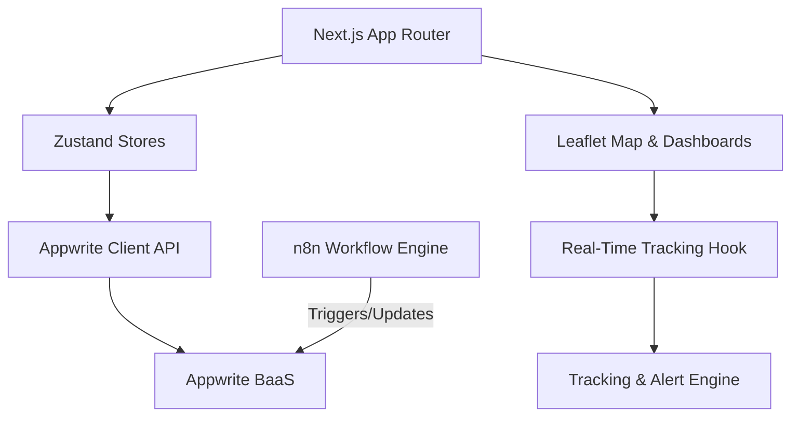

# WasteFlow — Technical Architecture & Explanation

WasteFlow is a smart waste management platform designed to automate municipal sanitation. It connects citizens, municipal administrators, and field crews in real time. The app integrates Next.js, Appwrite, Zustand, Leaflet maps, and n8n workflows to manage complaints, track vehicle fleets, calculate rewards, and audit automated workflows.

---

## 1. Technology Stack

### Core Framework
- **Next.js 16.2 (App Router)**: Handles client-side navigation, pages, layouts, and server-side rendering setup.
- **React 19.2**: Core UI rendering engine.
- **TypeScript 5.x**: Full static typing across frontend models, service layers, and tracking simulation types.

### State Management & Storage
- **Zustand**: Clean, global store (`useUserStore`, `useDashboardStore`) for managing user login sessions, active roles, and cached application states.
- **Appwrite Web SDK**: Backend-as-a-Service (BaaS) providing user authentication, user-roles determination, database storage (collections: `citizens`, `workers`, `complaints`, `rewards`, `violations`), and real-time subscription channels.

### UI & Map Visualization
- **Tailwind CSS v4 / PostCSS**: Standard utility styles and layouts.
- **Leaflet & React-Leaflet**: Renders the interactive map showing ward boundaries, garbage truck locations, planned routes, and real-time path deviation trails.
- **Lucide React**: High-quality UI icons.
- **Recharts**: Operational charts and metrics visualization in the dashboards.

---

## 2. System Architecture

WasteFlow follows a modular structure separated into a persistent **Appwrite database service layer** and a client-side **Real-Time Simulation Engine** for fleet tracking:



### Module Breakdown

1. **Auth & Role Layer**:
   Users authenticate via Appwrite. A custom `authService` checks the user's ID against the `citizens` or `workers` collections to dynamically determine their layout access (`/citizen/*` vs `/admin/*`).
2. **Citizen Portal (`/citizen`)**:
   Provides complaints reporting with photo uploads, real-time complaint status timelines, and a points ledger showing earned rewards.
3. **Municipal Operations Portal (`/admin`)**:
   Enables administrators to view active complaints, review routes efficiency, resolve operational alerts, and track garbage truck fleets.
4. **Live Fleet Tracking Engine**:
   A custom coordinate simulation engine that generates realistic street paths in Indore, detects route deviations, raises warning alerts, and visualizes live truck compactors along dark/light Leaflet map views.

---

## 3. Directory & File Structure

Below is the file tree of the WasteFlow application:

```
e:/internal26/
├── app/                              # Next.js App Router Pages
│   ├── admin/                        # Municipal Operations Portal
│   │   ├── complaints/               # Complaints tracking dashboard
│   │   ├── dashboard/                # Live metrics & summary charts
│   │   ├── routes/                   # Ward route efficiency and scheduler
│   │   ├── tracking/                 # Real-time fleet tracking page
│   │   └── workers/                  # Worker performance & list
│   ├── citizen/                      # Citizen Portal
│   │   ├── dashboard/                # Citizen dashboard, stats, and activity
│   │   ├── file-complaint/           # Create complaint with photo & GPS
│   │   ├── my-complaints/            # Interactive complaints list
│   │   └── rewards/                  # Citizen points balance and history
│   ├── globals.css                   # Global styles & Tailwind entry
│   ├── layout.tsx                    # Core root HTML layout
│   └── page.tsx                      # Public-facing Landing Page
├── components/                       # Shared UI components
│   ├── site-header.tsx               # Standardized page headers
│   ├── citizen-sidebar.tsx           # Sidebar navigation for citizens
│   ├── app-sidebar.tsx               # Sidebar navigation for admins
│   ├── ui/                           # Shadcn standard UI components
│   └── tracking/                     # Fleet tracking UI components
│       ├── alerts-panel.tsx          # Real-time anomaly alerts list
│       ├── metrics-panel.tsx         # Fleet statistics summary strip
│       ├── tracking-map.tsx          # Leaflet map, polylines, and markers
│       └── vehicle-detail.tsx        # Dynamic detail drawer for selected truck
├── hooks/                            # Simulation hooks
│   └── use-realtime-tracking.ts      # Connects React UI to the simulation loop
├── services/                         # Tracking Simulation Core
│   └── tracking/
│       ├── alert-engine.ts           # Processes and formats vehicle warnings
│       ├── mock-routes.ts            # Generates winding road paths in Indore
│       ├── tracking-engine.ts        # Updates positions & tracks path deviations
│       └── vehicle-generator.ts      # Generates simulated garbage trucks
├── src/                              # Base directory for domain logic
│   ├── components/                   # Domain charts & features
│   ├── hooks/                        # Custom domain Appwrite hooks
│   ├── services/
│   │   └── appwrite/
│   │       └── client.ts             # Appwrite Database & Auth services
│   ├── store/
│   │   └── index.ts                  # Zustand state store
│   └── types/
│       └── index.ts                  # Core TypeScript types
├── types/                            # Simulation specific types
│   └── tracking.ts                   # Vehicle tracking interfaces
├── datbase-schema.md                 # Detailed Appwrite database collections schema
└── landing_page_content.md           # Copy and texts of the main homepage
```

---

## 4. Key Workflows

### Complaint Dispatch Automation
1. A citizen logs a complaint with a location and category in the citizen dashboard.
2. Appwrite stores the record, triggering an **n8n automation workflow** web-hook.
3. n8n fetches the closest available worker in that ward, sends out SMS/email notifications, and updates the assignment on Appwrite automatically.

### Door-to-Door Route Simulation & Deviation Detection
1. The **Tracking Engine** runs at a configurable simulation speed.
2. Vehicles move along a planned street polyline representing Indore wards.
3. If an anomaly is triggered, a vehicle status changes to `delayed` and `isDeviated` becomes `true`.
4. The engine adds a cumulative lateral offset to its position to simulate driving off-route, and records a breadcrumb path (`deviationPath`).
5. The **Tracking Map** reads this state and renders a bold orange line representing the deviation trail, alongside a warning in the **Alerts Panel**.
