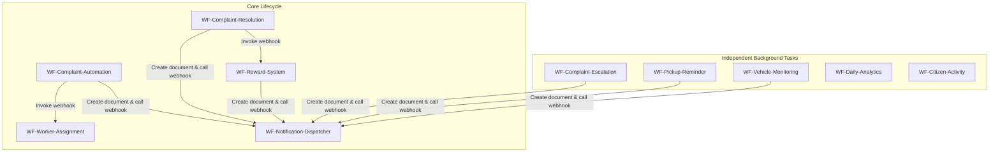

# WasteFlow — n8n Automation Workflows

This directory contains the complete n8n workflow automation suite designed for the WasteFlow Smart Waste Management system. These workflows coordinate with the Appwrite REST API to automate task assignments, reminders, escalations, citizen rewards, and daily analytics reporting.

---

## Directory Structure

```
automation/
├── README.md                          # Setup & testing guide (this file)
├── workflows/                         # Import-ready n8n workflow JSONs
│   ├── WF-Complaint-Automation.json
│   ├── WF-Worker-Assignment.json
│   ├── WF-Notification-Dispatcher.json
│   ├── WF-Complaint-Resolution.json
│   ├── WF-Complaint-Escalation.json
│   ├── WF-Reward-System.json
│   ├── WF-Daily-Analytics.json
│   ├── WF-Pickup-Reminder.json
│   ├── WF-Vehicle-Monitoring.json
│   └── WF-Citizen-Activity.json
├── docs/                              # Detailed markdown specs for each workflow
│   ├── Workflow-01.md                 # WF-Complaint-Automation
│   ├── Workflow-02.md                 # WF-Worker-Assignment
│   └── ...
├── payloads/                          # Sample JSON webhook trigger payloads
│   ├── complaint-created.json
│   ├── complaint-resolved.json
│   └── ...
└── postman/                           # Integration testing artifacts
    ├── WasteFlow.postman_collection.json
    └── Environment.json
```

---

## Workflow Dependency Graph

The core complaint lifecycle flows sequentially via webhooks and inter-workflow calls, whereas utility and reporting workflows execute independently:



---

## Installation & Import Guide

To import these workflows into n8n:

1. Open your n8n workspace editor.
2. Click on the **+ Add Workflow** button or open an empty canvas.
3. Click the three-dot menu in the upper-right corner.
4. Select **Import from File** and upload the desired `.json` file from the `workflows/` directory.
5. Repeat for all workflows.
6. Toggle the **Active** switch in the upper-right of each workflow to enable it.

---

## Required n8n Credentials & Headers

All HTTP Request nodes targeting Appwrite are pre-configured to read authorization details from headers. You must search and replace placeholder headers inside the imported workflow JSONs or configure them in n8n environment variables:

| Parameter Key | Description | Default / Placeholder |
|---|---|---|
| `X-Appwrite-Project` | Your Appwrite project ID | `YOUR_PROJECT_ID` |
| `X-Appwrite-Key` | Your Appwrite API Secret Key | `YOUR_API_KEY` |
| `DATABASE_ID` | Database ID of `wasteflow_db` | `6a540f2e001dfabaccb5` |
| `WasteFlow SMTP` | SMTP Credentials used by Send Email nodes | Need to create in n8n credentials |
| SMS API Token | Bearer token used by SMS HTTP dispatcher | `YOUR_SMS_PROVIDER_TOKEN` |
| Push API Token | Bearer token used by Push HTTP dispatcher | `YOUR_PUSH_PROVIDER_TOKEN` |

---

## Automated Webhook Integration Testing

A Postman collection is provided in `postman/` to trigger the webhooks.

1. Open Postman.
2. Import `postman/WasteFlow.postman_collection.json` and `postman/Environment.json`.
3. Set your active environment to **WasteFlow Local**.
4. Configure the variables:
   - `n8n_url`: URL of your running n8n instance (e.g. `http://localhost:5678`).
   - `complaintId`: A valid complaint document ID (seeding created 40 records).
   - `citizenId`: A valid citizen document ID.
   - `notificationId`: A valid notification document ID.
   - `workerId`: A valid worker document ID.
5. Trigger any request to run the target workflow pipeline immediately.
